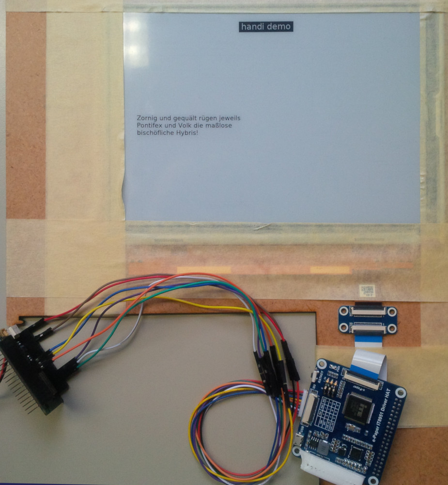

# ePaper example

Proof-of-concept Arduino sketch [Waveshare 9.7 inch e-Paper Display](https://www.waveshare.com/9.7inch-e-paper-hat.htm) (SPI) with [font rendering](https://github.com/mcufont/mcufont).

Tested on [ESP32](https://www.espressif.com/en/products/hardware/esp32/overview).

## Build instructions

Make sure to check out project including submodules

    git clone --recursive https://github.com/thelazt/waveshare-9.7inch-e-paper-demo.git

Load sketch in Arduino and run.

(Ugly symlinks in sketch directory due to the lack of real folder support in Arduino)

### Example Wiring

This example was tested using a [DFRobot FireBeetle ESP32](https://wiki.dfrobot.com/FireBeetle_ESP32_IOT_Microcontroller(V3.0)__Supports_Wi-Fi_&_Bluetooth__SKU__DFR0478) connected to the [HAT via SPI (see "Pinouts")](https://www.waveshare.com/9.7inch-e-paper-hat.htm)

    [ESP32] --- [ePaper HAT]
    VCC     --- 5V   (red)
    GND     --- GND  (black)
    GPIO 19 --- MISO (blue)
    GPIO 23 --- MOSI (yellow)
    GPIO 18 --- SCK  (orange)
    GPIO 25 --- CS   (green)
    GPIO 26 --- RST  (white)
    GPIO 27 --- HRDY (purple)

## Add custom Fonts

Add required fonts (in [TrueType Format](https://en.wikipedia.org/wiki/TTF)) into folder `fonts`.

*Example:* To build DejaVuSans in 12pt run

    cd epaper/fonts
    ./addfont.sh DejaVuSans.ttf 12
    Importing DejaVuSans.ttf to DejaVuSans12.dat
    Done: 5208 unique glyphs.
    Font originally had 5208 glyphs.
    After filtering, 193 glyphs remain.
    Original size is 10168 bytes
    Press ctrl-C at any time to stop.
    Results are saved automatically after each iteration.
    Limit is 50 iterations
    iteration 1, size 7202 bytes, speed 88980 B/min
    iteration 2, size 6699 bytes, speed 104070 B/min
    [...]
    iteration 49, size 5426 bytes, speed 7689 B/min
    iteration 50, size 5426 bytes, speed 7689 B/min
    Wrote DejaVuSans12.c
    Created DejaVuSans12.c!

